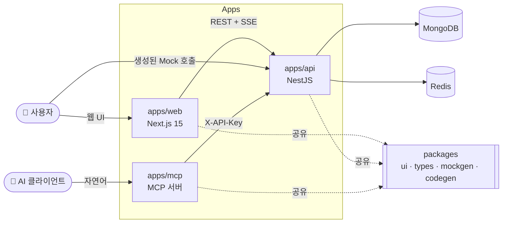

<div align="center">

# 🧩 JSON Mock Hub

**스키마만 정의하면, 호출 가능한 Mock API가 즉시 만들어집니다.**

프론트엔드 개발자가 백엔드 없이도 실제와 같은 REST API로 개발·테스트할 수 있게 해주는 풀스택 서비스입니다.
스키마 빌더 · 실시간 협업 · 클라이언트 코드 자동 생성 · **AI(MCP) 연동**까지 다룹니다.

<!-- 배포 후 아래 링크/뱃지를 채우세요 -->
[🔗 라이브 데모](#) · [🎬 데모 영상](#) · [프론트엔드 문서](apps/web/README.md) · [백엔드 문서](apps/api/README.md)

`Next.js 15` · `React 19` · `NestJS` · `MongoDB` · `Redis` · `TanStack Query` · `Turborepo`

</div>

---

## 📸 미리보기

<!--
  포트폴리오 임팩트의 핵심입니다. 아래에 화면 GIF/스크린샷 2~3장을 넣으세요.
  추천: (1) 스키마 빌더로 Mock 생성 → URL 반환  (2) 파일 트리 실시간 동기화  (3) 코드 자동 생성
  예: 
-->
> _여기에 스키마 빌더 · 실시간 트리 · 코드 생성 화면 GIF를 추가하세요._

---

## 💡 어떤 문제를 푸나요?

프론트엔드 개발 중 **백엔드 API가 아직 없을 때** 개발이 막힙니다. 기존 목킹 도구는 정적 JSON을 흉내 내는 수준에 그칩니다.

**JSON Mock Hub는:**
- 필드/타입/중첩 구조를 UI로 정의하면 → faker 기반의 **진짜 같은 데이터**를 생성하고
- 목록·단건·페이지네이션·CRUD가 동작하는 **실제 호출 가능한 REST 엔드포인트**를 서브도메인으로 제공하며
- 그 스키마로 **TypeScript 타입·API 클라이언트·React Query 훅·검증 코드**까지 만들어 줍니다.
- 나아가 **AI 어시스턴트(Claude 등)** 가 자연어로 Mock API를 만들고 관리할 수 있습니다.

---

## ✨ 주요 기능

| 기능 | 설명 |
| :--- | :--- |
| 🏗️ **스키마 빌더** | 필드·타입·중첩(object/array)을 UI로 정의, faker 목 데이터 미리보기 |
| 🌳 **파일 트리 탐색기** | 폴더/Mock API를 트리로 관리(인라인 편집·드래그 이동·권한별 액션) |
| ⚡ **실시간 동기화** | SSE로 다른 세션의 생성/이동/삭제를 즉시 반영 |
| 🔌 **동적 Mock 서빙** | `{workspaceId}.도메인/api/*` 서브도메인으로 CRUD 응답 생성 |
| 🧑‍💻 **코드 자동 생성** | 타입 · fetch/axios 클라이언트 · TanStack Query 훅 · zod/yup/joi 검증 |
| 👥 **워크스페이스 & 권한(RBAC)** | owner/member 역할, 세부 권한, 비밀번호 참여, API 키 |
| 🌐 **다국어** | 한국어/영어 (next-intl) |
| 🤖 **MCP 서버 연동** | AI 클라이언트에서 Mock API를 도구로 사용 |

---

## 🏛️ 아키텍처

Turborepo 모노레포로, **3개 앱**이 **공용 패키지**를 공유합니다.



- **`apps/web`** — Next.js App Router 프론트엔드 · [문서](apps/web/README.md)
- **`apps/api`** — NestJS 백엔드(인증·권한·Mock 서빙·SSE) · [문서](apps/api/README.md)
- **`apps/mcp`** — AI 연동용 Model Context Protocol 서버
- **`packages/*`** — `types`(도메인 타입)·`mockgen`(목 생성)·`codegen`(코드 생성)·`ui`(shadcn)를 세 앱이 공유해 **계약을 일치**시킴

---

## 🛠️ 기술 스택

**Frontend** · Next.js 15 (App Router) · React 19 · TanStack Query v5 · Zustand · react-hook-form + zod · shadcn/ui · Tailwind CSS v4 · react-arborist · shiki · next-intl

**Backend** · NestJS 10 · MongoDB(Mongoose) · Redis(ioredis) · Passport(JWT/Google OAuth) · class-validator · SSE · AOP

**Infra/Tooling** · Turborepo · TypeScript · Jest + RTL · ESLint · Docker

---

## 🎯 기술적 하이라이트

> 면접에서 이야기할 수 있는 "쉽지 않았던" 지점들.

- **서브도메인 기반 멀티테넌시** — 하나의 서버가 요청 호스트(`X-Forwarded-Host`)에서 워크스페이스를 추출해 워크스페이스별 Mock을 서빙.
- **실시간 협업(SSE)** — 파일 트리 변경을 이벤트로 브로드캐스트, heartbeat로 프록시 유휴 타임아웃 대응.
- **다층 권한 방어(RBAC)** — 서비스 쿼리 + 멤버십 가드 + `@RequirePermission` 데코레이터.
- **AI 연동(MCP)** — 경로 기반 도구 설계 + `elicitation`으로 코드 생성 옵션을 사용자에게 선택받기.
- **모노레포 계약 공유** — `@workspace/types`로 프론트·백엔드·MCP가 동일 스키마 타입을 사용.
- **인증 견고화** — JWT access/refresh 쿠키 회전 + 401 인터셉터의 경쟁 상태(대기열) 제어.

---

## 🚀 시작하기

### 요구사항
- Node.js 20+
- MongoDB, Redis

### 빠른 실행
```bash
# 1) 설치
npm install

# 2) 환경 변수 설정
#    - apps/api/.env.development  (MONGODB_URI, REDIS_URL, JWT_* 등 → apps/api/README.md 참고)
#    - apps/web/.env.local        (NEXT_PUBLIC_BACKEND_URL 등 → apps/web/README.md 참고)

# 3) 개발 서버 실행
npm run dev -w apps/api    # http://localhost:4001
npm run dev -w apps/web    # http://localhost:4000
```

앱별 상세 실행/환경변수는 각 문서를 참고하세요 → [프론트엔드](apps/web/README.md) · [백엔드](apps/api/README.md)

---

## 📚 문서

- [프론트엔드(apps/web)](apps/web/README.md)
- [백엔드(apps/api)](apps/api/README.md)
